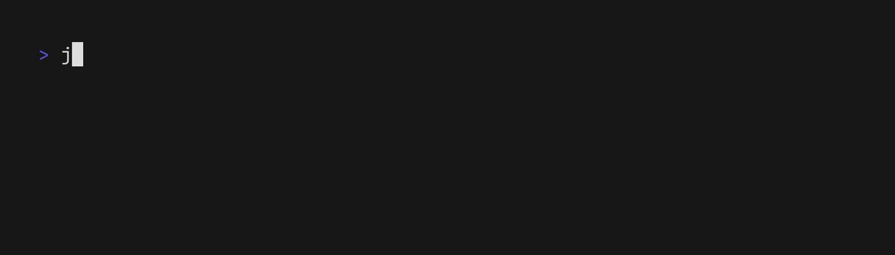
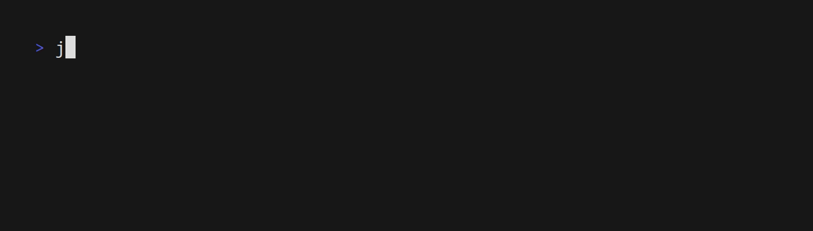

# jackdaw

`jackdaw` is a workflow execution engine for the [Serverless Workflows](https://serverlessworkflow.io/) specification. It supports durable execution of workflows through a persistence layer, as well as caching execution to prevent duplicate execution of expensive workflow tasks. `jackdaw` is written in Rust, and is designed for extensibiliy, performance, and easy to deploy into many contexts. 

The default version of `jackdaw` comes with a full embedded javascript interpreter (via [rustyscript](https://github.com/rscarson/rustyscript) and [deno_core](https://github.com/denoland/deno_core)), as well as embedded python (via [pyo3](https://pyo3.rs/)). This allows `jackdaw` to support Serverless Workflows that have python and javascript sections very efficiently.

`jackdaw` is also committed to always being free and useful open source software under the standard Apache 2.0 license. There's no risk of vendor lock-in, because any workflow you run with `jackdaw` can be executed by any of the other Serverless Workflow runtimes!

## Getting started

Let's start off with the simplest Serverless Workflow we can imagine, a simple and classic Hello World:

```yaml
document:
  dsl: '1.0.2'
  name: hello-world
  namespace: examples
  version: '0.1.0'
output:
  as: .statement
do:
  - say:
      set:
        statement: Hello, World!
```

If we save this file as `hello-world.sw.yaml`, we can run it with the command

```
jackdaw run hello-world.sw.yaml
```


#### --debug flag

By default, `jackdaw` will hide verbose output. If you would like to see additional information to make it easier to troubleshoot what is happening, use the `--debug` flag:

```
jackdaw run hello-world.sw.yaml --debug
```


## Installation

### Docker image

`jackdaw` is available as a container image from the releases page

### Download the binary

#### `jackdaw`

The `jackdaw` binary can be downloaded from the releases page. Please note that `jackdaw` requires `libpython` 3.14 to be installed.

#### jackdaw-lite

`jackdaw-lite` (statically-compiled without embedded python or javascript) can alternatively be downloaded. This version has no dependencies and is therefore very portable, but has more limited support for executing python and javascript. If you don't need support for those languages, this can be a very good option because it is self-contained and has no dependencies.

### From source

#### default version

The most straightforward way to install `jackdaw` is to clone the repository and run 

```bash
just build-release
```

This will compile the release binary

#### jackdaw-lite

`jackdaw-lite`, the statically-compiled version of `jackdaw` that does not have embedded javascript and python interpreters, can be built with 

```
just build-lite-static
```

## Usage

### `run`

#### container

`jackdaw` supports executing commands in containers. The default (and currently only) container runtime supported is Docker.

TODO: fix container output

```yaml
document:
  dsl: '1.0.2'
  namespace: default
  name: test-env-vars
  version: '1.0.0'
do:
  - printEnv:
      run:
        container:
          image: alpine:latest
          command: sh -c "echo MY_VAR=$MY_VAR ANOTHER=$ANOTHER"
          environment:
            MY_VAR: "HelloWorld"
            ANOTHER: "TestValue"
```

```bash
jackdaw run examples/container/container-env-vars.sw.yaml
```


#### Python

Python scripts are supported by `jackdaw`. The most straightforward way to use a python script is to embed the script directly in the workflow:


Alternatively, you can also define a python module, with dependencies, and execute a function within that module. An example can be found in `examples/python-module`.
```yaml
document:
  dsl: '1.0.2'
  namespace: examples
  name: python-basics
  version: '1.0.0'
do:
  - calculateFactorial:
      run:
        script:
          language: python
          arguments:
            - "10"
          code: |
            import sys
            import json

            def factorial(n):
                if n <= 1:
                    return 1
                return n * factorial(n - 1)

            n = int(sys.argv[1])
            result = {
                "input": n,
                "factorial": factorial(n),
                "message": f"The factorial of {n} is {factorial(n)}"
            }

            print(json.dumps(result))
      output:
        as: '${ { result: . } }'

  - processData:
      run:
        script:
          language: python
          arguments:
            - ${ .result.factorial }
          code: |
            import sys
            import json

            factorial_value = int(sys.argv[1])
            import math

            result = {
                "factorial": factorial_value,
                "log10": math.log10(factorial_value),
                "sqrt": math.sqrt(factorial_value),
                "formatted": f"{factorial_value:,}"
            }

            print(json.dumps(result))
```

```bash
jackdaw run examples/python/python-basics.sw.yaml
```


#### Javascript

Serverless Workflows support scripts written in ES2024. `jackdaw` supports javascript scripts by embedding `deno_core` via rustyscript. This makes it possible to embed inlined javascript scripts into a workflow task:
```yaml
document:
  dsl: '1.0.2'
  namespace: examples
  name: javascript-basics
  version: '1.0.0'
do:
  - fibonacci:
      run:
        script:
          language: javascript
          arguments:
            - "15"
          code: |
            const n = parseInt(process.argv[2]);

            function fibonacci(num) {
              if (num <= 1) return num;
              return fibonacci(num - 1) + fibonacci(num - 2);
            }

            const result = {
              input: n,
              fibonacci: fibonacci(n),
              sequence: Array.from({length: n + 1}, (_, i) => fibonacci(i)),
              message: `The ${n}th Fibonacci number is ${fibonacci(n)}`
            };

            console.log(JSON.stringify(result));
      output:
        as: '${ { result: . } }'

  - processSequence:
      run:
        script:
          language: javascript
          arguments:
            - ${ .result.sequence }
          code: |
            const sequence = JSON.parse(process.argv[2]);

            const result = {
              sequence: sequence,
              sum: sequence.reduce((a, b) => a + b, 0),
              average: sequence.reduce((a, b) => a + b, 0) / sequence.length,
              max: Math.max(...sequence),
              min: Math.min(...sequence)
            };

            console.log(JSON.stringify(result));
```

```bash
jackdaw run examples/javascript/javascript-basics.sw.yaml
```


#### Nested workflows

Serverless Workflows can nest other workflows, making reuse very powerful. In the following example, Workflow A imports Workflow B, which in turn imports Workflow C.

Workflow C:
```yaml
document:
  dsl: '1.0.2'
  namespace: examples
  name: workflow-c
  version: '1.0.0'
do:
  - subtractTen:
      set:
        value: '${ .value - 10 }'
output:
  as: '${ . }'
```

Workflow B:
```yaml
document:
  dsl: '1.0.2'
  namespace: examples
  name: workflow-b
  version: '1.0.0'
do:
  - multiplyByTwo:
      set:
        value: '${ .value * 2 }'

  - callWorkflowC:
      run:
        workflow:
          namespace: examples
          name: workflow-c
          version: '1.0.0'
          input:
            value: '${ .value }'
output:
  as: '${ . }'
```

Workflow A:
```yaml
document:
  dsl: '1.0.2'
  namespace: examples
  name: workflow-a
  version: '1.0.0'
do:
  - addFive:
      set:
        value: '${ .value + 5 }'

  - callWorkflowB:
      run:
        workflow:
          namespace: examples
          name: workflow-b
          version: '1.0.0'
          input:
            value: '${ .value }'
output:
  as: '${ . }'
```

Execution:
```bash
jackdaw run examples/nested-workflows/workflow-a.yaml -i '{"value": 10}'
```

#### Tasks from a Catalog

Catalogs are collections of workflows, and act like reusable libraries. It is easy to define a new catalog and make it available for consumption within a workflow. `jackdaw` fully supports workflow catalogs.

To define a catalog:
```yaml
# examples/catalog/functions/add-numbers/1.0.0/function.yaml
document:
  dsl: '1.0.2'
  namespace: examples.functions
  name: add-numbers
  version: '1.0.0'
  description: 'Add two numbers together'
input:
  schema:
    type: object
    properties:
      a:
        type: number
      b:
        type: number
    required:
      - a
      - b
do:
  - add:
      set:
        result: '${ .a + .b }'
```

To consume a workflow from a catalog:
```yaml
document:
  dsl: '1.0.2'
  namespace: examples
  name: use-catalog
  version: '1.0.0'
use:
  catalogs:
    local:
      endpoint:
        uri: file://./examples/catalog/functions
do:
  - addNumbers:
      call: add-numbers:1.0.0
      with:
        a: 10
        b: 5
      output:
        as: '${ { addResult: .result } }'

  - multiplyNumbers:
      call: multiply-numbers:1.0.0
      with:
        a: '${ .addResult }'
        b: 3
```

```bash
jackdaw run examples/catalog/use-catalog.sw.yaml
```

#### Caching

Caching is a core feature of `jackdaw`. During execution, the input object of every task is hashed, and checked against the cache. If the same task was executed previously with the exact input object, then the cached output will be pulled from the cache and the task will not execute again. This can be quite useful when executing workflows with expensive tasks.

An example workflow that demonstrates the benefit of caching is the following `cache-demo` workflow. It has an expensive first task, which needs to be calculated but doesn't change based off of inputs. If it is not cached, then it has to be recalculated every single time. With caching enabled, it does not have to be recalculated, and the workflow moves to the other tasks quickly.

```yaml
document:
  dsl: '1.0.0'
  namespace: examples
  name: cache-demo
  version: '1.0.0'
  description: |
    Demonstrates caching behavior with an expensive computation.
    Step 1 performs an expensive calculation (simulated with sleep).
    Step 2 uses workflow input to process user data.
    Step 3 combines outputs from both steps.

    When run with different inputs:
    - First run: All steps execute
    - Second run with different input: Step 1 uses cached result, Steps 2 and 3 recalculate

do:
  # Step 1: Expensive computation that doesn't depend on input
  # This will be cached and reused across runs with different inputs
  - expensiveComputation:
      input:
        from: '{}'
      run:
        script:
          language: python
          code: |
            import time
            import hashlib

            time.sleep(5)

            result = {
                "computed_hash": hashlib.sha256(b"expensive-operation").hexdigest(),
                "dataset_size": 1000000,
                "processing_time": 5.0,
                "metadata": {
                    "algorithm": "sha256",
                    "iterations": 1000000
                }
            }

            print(result["computed_hash"])
      output:
        as: '${ { expensiveComputation: . } }'

  # Step 2: Process user input
  # This depends on workflow input, so it will recalculate when input changes
  - processUserInput:
      run: 
        script:
          language: python
          arguments:
            - ${ .userData }
            - ${ .expensiveComputation }
          code: |
            import sys
            import hashlib
            import json

            user_data = sys.argv[1]

            expensive_result = str(sys.argv[2])

            user_hash = hashlib.md5(user_data.encode()).hexdigest()

            result = {
                "user_hash": user_hash,
                "user_data_length": len(user_data),
                "processed": True,
                "expensive_computation": expensive_result
            }

            print(json.dumps(result))

  - combineResults:
      run:
        script:
          language: python
          arguments:
            - ${ .user_hash }
          code: |
            import sys
            import json
            user_hash = sys.argv[1]
            print(user_hash)
```

```bash
jackdaw run examples/cache/cache.sw.yaml -i '{ "userData": "user-data-1" }'
```



#### Persistence

```yaml
document:
  dsl: '1.0.2'
  namespace: examples
  name: persistence-demo
  version: '1.0.0'
do:
  - step1:
      run:
        script:
          language: python
          code: |
            import json
            import time

            print("Step 1: Processing initial data...")
            time.sleep(1)

            result = {
                "step": 1,
                "status": "completed",
                "timestamp": time.time(),
                "data": "Important data from step 1"
            }

            print(json.dumps(result))
      output:
        as: '${ { step1: . } }'

  - step2:
      run:
        script:
          language: python
          arguments:
            - ${ .step1 }
          code: |
            import json
            import time
            import sys

            step1_data = json.loads(sys.argv[1])

            print("Step 2: Building on step 1 results...")
            time.sleep(1)

            result = {
                "step": 2,
                "status": "completed",
                "timestamp": time.time(),
                "data": "Processed data from step 2",
                "previous_data": step1_data["data"]
            }

            print(json.dumps(result))
      output:
        as: '${ { step2: . } }'

  - step3_mayFail:
      run:
        script:
          language: python
          arguments:
            - ${ .step2 }
            - ${ .attempt }
          code: |
            import json
            import time
            import sys

            step2_data = json.loads(sys.argv[1])
            attempt = int(sys.argv[2])

            print(f"Step 3: Attempting to complete workflow (attempt #{attempt})...")
            time.sleep(1)

            # Fail on first attempt to demonstrate persistence
            if attempt == 1:
                print("ERROR: Step 3 failed! This demonstrates workflow failure.")
                print("State has been persisted. Re-run with attempt=2 to resume.")
                sys.exit(1)

            # Succeed on second attempt
            result = {
                "step": 3,
                "status": "completed",
                "timestamp": time.time(),
                "data": "Final result after resuming from persisted state",
                "previous_data": step2_data["data"],
                "message": "Workflow completed successfully after resuming!"
            }

            print(json.dumps(result))
```

```bash
# First run (will fail at step 3, but persist state)
jackdaw run examples/persistence/persistence.sw.yaml --persistence-provider redb --input '{"attempt": 1}'

# Second run (will resume from persisted state and complete)
jackdaw run examples/persistence/persistence.sw.yaml --persistence-provider redb --input '{"attempt": 2}'
```


#### Listeners

##### HTTP Listeners (OpenAPI)

```yaml
document:
  dsl: '1.0.2'
  namespace: examples
  name: calculator-api
  version: '1.0.0'
do:
  - handleAddRequests:
      listen:
        to:
          any:
            - with:
                source:
                  uri: http://0.0.0.0:8080/api/v1/add
                  schema:
                    format: openapi
                    resource:
                      endpoint: openapi.spec.yaml
                      name: AddRequest
          until: '${ false }'
      foreach:
        item: event
        do:
          - executeAdd:
              call: python
              with:
                module: calculator.add
                function: handler
                arguments:
                  - ${ $event }

  - handleMultiplyRequests:
      listen:
        to:
          any:
            - with:
                source:
                  uri: http://0.0.0.0:8080/api/v1/multiply
                  schema:
                    format: openapi
                    resource:
                      endpoint: openapi.spec.yaml
                      name: MultiplyRequest
          until: '${ false }'
      foreach:
        item: event
        do:
          - executeMultiply:
              call: python
              with:
                module: calculator.multiply
                function: handler
                arguments:
                  - ${ $event }
```

```bash
# Python OpenAPI listener example
jackdaw run examples/python-openapi-listener/calculator-api.sw.yaml

# JavaScript OpenAPI listener example
jackdaw run examples/javascript-openapi-listener/calculator-api.sw.yaml
```

```bash
# Test the endpoints
curl -X POST http://localhost:8080/api/v1/add -H "Content-Type: application/json" -d '{"a": 5, "b": 3}'
curl -X POST http://localhost:8080/api/v1/multiply -H "Content-Type: application/json" -d '{"a": 4, "b": 7}'
```


##### gRPC Listeners

```bash
# Python gRPC listener example
jackdaw run examples/python-grpc-listener/calculator-api.sw.yaml

# JavaScript gRPC listener example
jackdaw run examples/javascript-grpc-listener/calculator-api.sw.yaml
```


### `validate`

```
jackdaw validate hello-world.sw.yaml
```



## Providers

### Cache Providers

#### in-memory

```bash
jackdaw run examples/cache/cache.sw.yaml --cache-provider memory -i '{ "userData": "user-data-1"}'
```

#### redb

```bash
jackdaw run examples/cache/cache.sw.yaml --cache-provider redb -i '{ "userData": "user-data-1"}'
```

#### sqlite

```bash
jackdaw run examples/cache/cache.sw.yaml --cache-provider sqlite --sqlite-db-url=cache.sqlite -i '{ "userData": "user-data-1"}'
```

#### postgres

```bash
jackdaw run examples/cache/cache.sw.yaml --cache-provider postgres --postgres-db-name=default --postgres-user default_user --postgres-password password --postgres-hostname localhost -i '{ "userData": "user-data-1"}'
```

### Persistence Providers

#### in-memory

```bash
jackdaw run examples/persistence/persistence.sw.yaml --persistence-provider memory -i '{ "attempt": 1 }'
```

#### redb

```bash
jackdaw run examples/persistence/persistence.sw.yaml --persistence-provider redb -i '{ "attempt": 1 }'
```

#### sqlite

```bash
jackdaw run examples/persistence/persistence.sw.yaml --persistence-provider sqlite --sqlite-db-url=persistence.sqlite -i '{ "attempt": 1 }'
```

#### postgres

```bash
jackdaw run examples/persistence/persistence.sw.yaml --persistence-provider postgres --postgres-db-name=default --postgres-user default_user --postgres-password password --postgres-hostname localhost -i '{ "attempt": 1 }'
```
### Container Providers

#### Docker

### Executor Providers

#### OpenAPI

#### Python

#### Python External

#### Typescript

#### Typescript External

#### Rest

```yaml
document:
  dsl: '1.0.2'
  namespace: examples
  name: rest-api-calls
  version: '1.0.0'
do:
  - fetchUser:
      call: http
      with:
        method: get
        endpoint:
          uri: https://jsonplaceholder.typicode.com/users/1
      output:
        as: '${ { user: . } }'

  - fetchUserPosts:
      call: http
      with:
        method: get
        endpoint:
          uri: 'https://jsonplaceholder.typicode.com/posts?userId=${ .user.id }'
      output:
        as: '${ { posts: . } }'

  - summarizeData:
      run:
        script:
          language: python
          arguments:
            - ${ .user }
            - ${ .posts }
          code: |
            import sys
            import json

            user = json.loads(sys.argv[1])
            posts = json.loads(sys.argv[2])

            result = {
                "user_name": user["name"],
                "user_email": user["email"],
                "total_posts": len(posts),
                "post_titles": [post["title"] for post in posts]
            }

            print(json.dumps(result))
```

```bash
jackdaw run examples/rest/rest-api.sw.yaml
```


## Supported Serverless Features Matrix

## Roadmap
